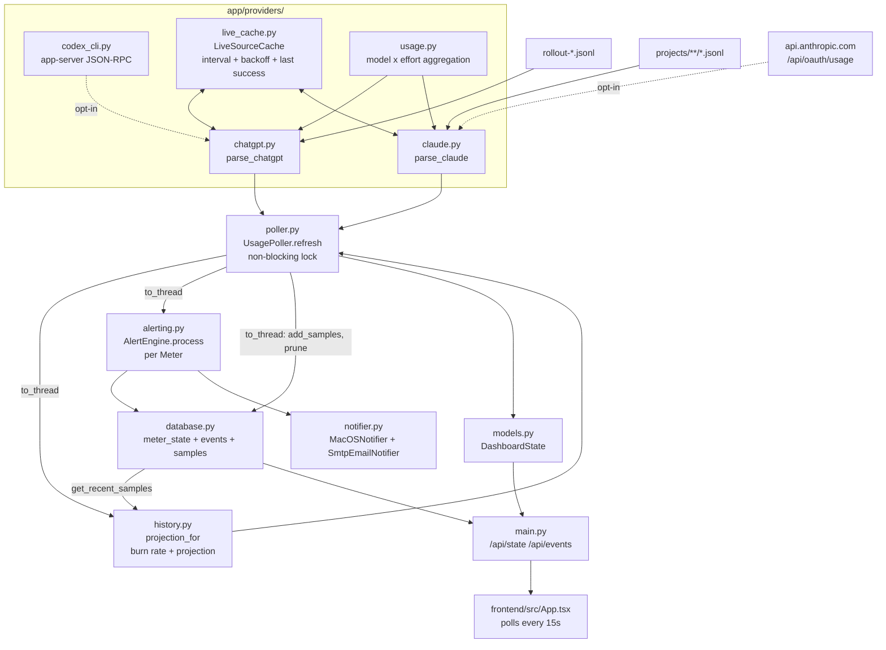
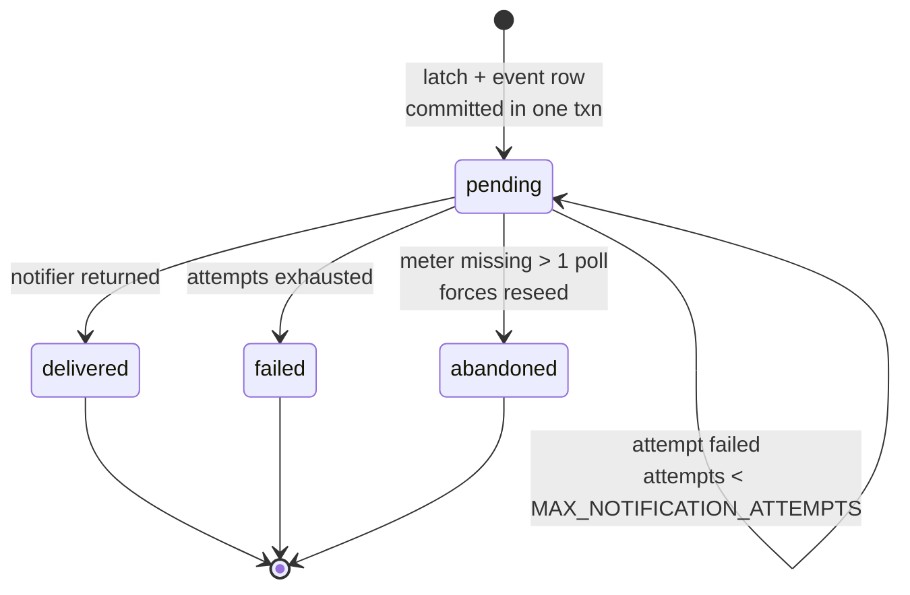

# CLAUDE.md

This file provides guidance to Claude Code (claude.ai/code) when working with code in this repository.

## What this is

Quota Glass: a private, single-user macOS dashboard for Claude and ChatGPT
subscription quota. FastAPI backend (`app/`) + React/Vite frontend
(`frontend/`) + SQLite (`./data/usage.db`). README.md documents every
environment variable and both opt-in live sources; read it before changing
configuration or provider behaviour.

## Commands

```bash
# Setup (once)
python3 -m venv .venv && .venv/bin/pip install -r requirements.txt
cd frontend && npm install && cd ..

# Run both processes (backend 127.0.0.1:8000, Vite 5173 proxying /api)
./run.sh

# Backend tests
.venv/bin/python -m pytest
.venv/bin/python -m pytest tests/test_providers.py::test_name   # single test

# Frontend checks
cd frontend && npx tsc --noEmit && npm run build
```

Use `.venv/bin/python -m pytest`, not bare `pytest`. There is no packaging
config (no pyproject/setup.cfg/pytest.ini); `python -m` puts the repo root on
`sys.path` so `import app` resolves. pytest-asyncio runs in strict mode, so
async tests need an explicit `@pytest.mark.asyncio`.

Target **Python 3.9** — no `X | Y` unions, no `asyncio.timeout`, use
`typing.List/Optional/Dict`. `run.sh` also targets macOS bash 3.2 (no `wait -n`).

## Architecture

One poll cycle, module by module. `to_thread` marks blocking work the poller
pushes off the event loop:



Two edges above encode the invariants that are easiest to break:
`LiveSourceCache` is bidirectional because a payload is **validated before it is
stored**, and `AlertEngine → database → notifier` is strictly ordered because
state is **committed before any notification is attempted**.

### Provider two-tier pattern

Each provider in `app/providers/` has a **local** path that always works and an
**opt-in live** path that must always degrade back to local:

| Provider | Local (default) | Live (opt-in) |
| --- | --- | --- |
| ChatGPT | newest `token_count` snapshot in `~/.codex/sessions/**/rollout-*.jsonl` | `codex app-server` JSON-RPC `account/rateLimits/read` (`ENABLE_CHATGPT_LIVE`) |
| Claude | assistant `usage` records in `~/.claude/projects/**/*.jsonl` | undocumented `GET api.anthropic.com/api/oauth/usage` (`ENABLE_CLAUDE_OAUTH`) |

`LiveSourceCache` (`providers/live_cache.py`) is the shared machinery for both
live paths: minimum call interval, exponential backoff, and retention of the
last successful payload. `ClaudeOAuthCache` subclasses it only to treat 429 +
`Retry-After` specially and to keep non-429 failures from escalating backoff.

Three invariants hold across both live paths — preserve them when editing:

1. **Validate before caching.** `_oauth_meters(data)` / `_live_reading(payload)`
   run *before* `record_success`, so any cached payload is guaranteed to yield
   meters on later failures.
2. **A previous success beats no reading.** While backed off, the cached
   payload is still rendered, with every meter marked `stale=True`. Only a
   source that has *never* succeeded falls back to the local path.
3. **Failure never propagates.** Any exception is converted into
   `ProviderState.error` text; the poller must not die.

### Meters and staleness

`Meter.has_quota=False` (Claude local) or `stale=True` means **never alert** —
`AlertEngine.process` returns early. Claude local records carry no subscription
percentage, so those meters are estimates only. Meter keys are
`"<provider>.<window>"`; `Database.mark_meter_presence` splits on `.` to
attribute a meter to a provider, so the format is load-bearing.

Model/effort aggregation is shared by both providers in `providers/usage.py`.
Model percentages are shares of the window; effort percentages are shares of
their own model. Effort is only ever read from the local record — records
naming none land under `UNSPECIFIED_EFFORT` and are never guessed at.

### Burn rate (`app/history.py`)

`projection_for` turns stored `samples` rows into `Meter.projection`: a rate in
percent per hour and the time the meter reaches 100%. Three rules carry the
correctness, and all three are about **which samples are allowed into the span**:

1. **Clip to the current window.** `window_start(meter)` is
   `resets_at - window_minutes * 60`. A span that straddles a rollover describes
   two windows and yields a negative delta. This is the same window-identity
   idea as `_window_changed`, and the ±1s `resets_at` jitter only shifts the
   boundary by a second.
2. **Drop stale rows.** A stale sample repeats a reading the provider never
   refreshed, so counting it stretches the span while holding the percentage
   flat and understates the rate.
3. **Append the live reading.** The poller persists samples *after* alerting, so
   the stored series always lags one poll; `projection_for` closes that gap
   itself rather than the pipeline being reordered.

The rate is the first-to-last delta, not a least-squares fit: `used_pct` only
rises inside a window, so the endpoint delta is already unbiased.

### Alerting durability (`app/alerting.py` + `app/database.py`)

`EXHAUSTED` fires on crossing `ALERT_THRESHOLD_PCT`; `REFRESHED` fires on window
rollover, a usage drop past `RESET_DROP_EPSILON_PCT`, or a reading below
`ALERT_RESET_PCT`. Window identity is deliberately **not** exact equality:
`resets_at` is truncated to a whole second from a microsecond timestamp, so two
reads of one window can differ by 1. `_window_changed` ignores differences
within `WINDOW_JITTER_TOLERANCE_SECONDS`; a real rollover moves the reset by a
whole window, so the two are never ambiguous.

`PROJECTED_EXHAUSTION` fires when `Meter.projection.exhausts_before_reset` and
the projection lands more than `PROJECTION_ALERT_MARGIN_SECONDS` before
`resets_at` — without that margin it flaps as the estimate drifts either side of
the reset. It is suppressed once `used_pct >= ALERT_THRESHOLD_PCT`, because
`EXHAUSTED` owns that case. It has its **own** latch
(`meter_state.fired_projection_for_window`) cleared in the same branch as the
exhaustion latch on rollover, and cleared by `mark_meter_presence` on reseed —
miss either and a stale latch suppresses a real warning.

The latch (`meter_state.fired_full_for_window`) and the event
rows are written in **one transaction before any notification is attempted**, so
a crash mid-delivery retries the same row after restart rather than losing or
duplicating an alert. Events move `pending → delivered | failed | abandoned`;
`abandoned` is set by `mark_meter_presence` when a meter vanishes for more than
one poll, which also forces a reseed so a stale latch cannot fire later.

The row lifecycle, which spans both files:



Notifiers (`app/notifier.py`) are a `Protocol`. `configured_notifier` composes
macOS `osascript` and SMTP delivery; email config errors raise at startup.

### Poller concurrency (`app/poller.py`)

Started as an asyncio task from the FastAPI lifespan. Two deliberate choices:

- The refresh lock is **non-blocking** — a concurrent `POST /api/refresh`
  returns current state rather than queueing. Queueing would park thread-pool
  workers the in-flight poll needs and can deadlock the poller permanently.
- It uses `threading.Lock`/`Event`, not asyncio primitives, so the poller is not
  bound to whichever event loop touches it first on Python 3.9. Blocking work
  goes through `asyncio.to_thread`.

Each stage appends to a per-poll `errors` list instead of raising;
`PollerHealth.status` becomes `degraded` and the joined text lands in
`last_error`, which is what the dashboard shows.

### Settings and frontend

`app/settings.py` is hand-rolled: every option is a constructor argument that
falls back to an env var. Tests inject values through the constructor, never
through the environment — add new options the same way, in both places.

`frontend/src/App.tsx` is the whole UI (single file, polls `/api/state` and
`/api/events` every 15s). Its TypeScript types mirror the pydantic models in
`app/models.py` by hand; changing a model means editing both.

## Testing conventions

Tests must not touch real usage directories, Keychain, the network, or display a
notification. Point `Settings(codex_sessions_dir=..., claude_projects_dir=...)`
at `tests/fixtures/` or `tmp_path`, and use the `recording_notifier` fixture.

`tests/test_run_script.py` extracts shell functions out of `run.sh` by name with
`awk` instead of executing the script — renaming a function there breaks those
tests, and the test file explains why running the script directly is unsafe.

## Privacy constraints

These are product requirements, not incidental:

- Both live sources are **off by default**; with them off, no network call,
  subprocess, or Keychain read happens at all.
- The Claude Keychain token is re-read immediately before each request, held
  only for that request, and never cached or written to disk. Only response
  payloads are cached, in memory.
- Quota Glass never reads `~/.codex/auth.json` and never handles Codex tokens —
  auth stays inside the Codex CLI.
- Claude dollar figures come from the small hardcoded `MODEL_PRICES` table in
  `providers/claude.py`. They are API-equivalent estimates, not billing data,
  and must stay labelled as such.
