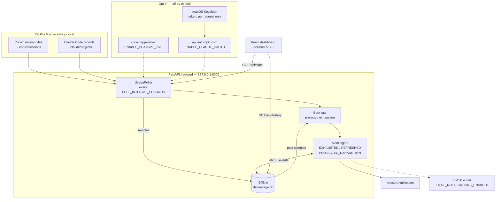

# Quota Glass

Quota Glass is a private, single-user macOS dashboard for Claude and ChatGPT
subscription usage. It combines quota gauges and reset countdowns with local
token estimates, 24-hour and 7-day quota history, burn-rate projections,
per-model effort breakdowns, credits, provider health, and a durable alert
history.

Local usage files are the default data source. Live ChatGPT quota, Claude OAuth,
and email delivery are separate opt-ins; the core dashboard needs no provider
API key or vendor billing account.

## Quick start

You need macOS, Python 3.9, Node.js, and npm. From this repository:

```bash
python3 -m venv .venv
.venv/bin/pip install -r requirements.txt
cd frontend
npm install
cd ..
./run.sh
```

Open [http://localhost:5173](http://localhost:5173). The backend and frontend
listen only on `127.0.0.1`; stop both with `Ctrl-C`.

Quota Glass can start before it finds usage records. Run at least one Codex or
Claude Code turn to populate the corresponding local source, then use the
dashboard's **Refresh now** control. No Homebrew, `uv`, Poetry, `pipx`,
`terminal-notifier`, API key, or system-wide Python package installation is
required.

## Architecture



Solid arrows are always on and never leave the machine. Dashed arrows are the
opt-in data paths. With both live sources disabled, Quota Glass makes no
provider data request, starts no live-source subprocess, and never reads
Keychain. Local macOS alerts still use the built-in `osascript` command when an
alert fires.

## Data sources

| Provider | Default source | Optional live source | Alert eligibility |
| --- | --- | --- | --- |
| ChatGPT | Codex rollout files | Codex CLI `app-server` | Fresh quota readings only; stale readings never alert |
| Claude | Claude Code assistant records | Undocumented Claude OAuth endpoint | Live quota readings only; local estimates never alert |

- **ChatGPT:** reads the newest usable `token_count` snapshot from
  `~/.codex/sessions/YYYY/MM/DD/rollout-*.jsonl`. The percentage comes directly
  from Codex's local rate-limit snapshot. Because Codex only updates it during a
  turn, readings older than `STALE_AFTER_MINUTES` (30 by default) are marked
  stale and never alert. Model mix is calculated from each turn's token delta
  and the active rollout model and reasoning effort.
- **Claude (default):** reads assistant usage records under
  `~/.claude/projects/**/*.jsonl` and aggregates rolling 5-hour and 7-day token
  totals and model mix, split by the effort recorded on each assistant turn.
  These local records do not contain subscription quota percentages, so the
  dashboard labels them as estimates and never alerts on them.

Both providers report the 5-hour and 7-day model mix as a per-model effort
breakdown: model percentages are shares of the window, and effort percentages
are shares of their own model. Effort is only ever read from the local record —
turns whose records name no effort are grouped under `unspecified` rather than
being assigned a guess.

The SQLite database is created at `./data/usage.db`. Alert latches survive app
restarts, preventing duplicate notifications.

## Configuration

Set environment variables before running `./run.sh`:

### Live sources

| Variable | Default | Meaning |
| --- | --- | --- |
| `ENABLE_CLAUDE_OAUTH` | `0` | Opt into Claude's undocumented live quota source. |
| `OAUTH_MIN_INTERVAL_SECONDS` | `300` | Minimum interval between Claude OAuth usage requests. |
| `ENABLE_CHATGPT_LIVE` | `0` | Opt into live ChatGPT quota via the Codex CLI. |
| `CHATGPT_LIVE_MIN_INTERVAL_SECONDS` | `300` | Minimum interval between Codex CLI usage reads. |
| `OAUTH_MAX_BACKOFF_SECONDS` | `3600` | Maximum exponential backoff used by both live-source caches. |
| `CODEX_CLI_PATH` | `codex` | Path to the Codex CLI executable. |
| `CODEX_CLI_TIMEOUT_SECONDS` | `20` | Timeout for a single Codex CLI read. |

### Local sources and freshness

| Variable | Default | Meaning |
| --- | --- | --- |
| `CODEX_SESSIONS_DIR` | `~/.codex/sessions` | Injectable Codex rollout root. |
| `CLAUDE_PROJECTS_DIR` | `~/.claude/projects` | Injectable Claude project root. |
| `STALE_AFTER_MINUTES` | `30` | Age after which a local Codex quota snapshot is stale. |
| `CHATGPT_CANDIDATE_FILES` | `5` | Number of recent usable Codex snapshots compared by timestamp. |

### Polling, alerts, and storage

| Variable | Default | Meaning |
| --- | --- | --- |
| `POLL_INTERVAL_SECONDS` | `60` | Backend poll interval. |
| `ALERT_THRESHOLD_PCT` | `100` | Percentage crossing that fires `EXHAUSTED`. |
| `ALERT_RESET_PCT` | `5` | Low-water percentage that confirms `REFRESHED`. |
| `HISTORY_RETENTION_DAYS` | `30` | Retention period for SQLite samples and events. |
| `MAX_NOTIFICATION_ATTEMPTS` | `3` | Delivery attempts allowed for each notification. |
| `NOTIFICATIONS_ENABLED` | `1` | Set to `0` to suppress macOS notifications. |
| `DATABASE_PATH` | `./data/usage.db` | SQLite file location. |

### Burn rate and projections

| Variable | Default | Meaning |
| --- | --- | --- |
| `ENABLE_BURN_RATE` | `1` | Set to `0` to stop computing burn rates and projections. |
| `BURN_RATE_WINDOW_MINUTES` | `60` | Trailing span the rate is measured over. |
| `BURN_RATE_MIN_SAMPLES` | `3` | Samples required before a rate is reported. |
| `BURN_RATE_MIN_SPAN_SECONDS` | `600` | Time the samples must cover before a rate is reported. |
| `PROJECTION_ALERT_ENABLED` | `1` | Set to `0` to keep the projection but suppress its alert. |
| `PROJECTION_ALERT_MARGIN_SECONDS` | `900` | How far ahead of the reset a projection must land to be worth alerting on. |

Unlike the live sources, these default on: the burn rate is arithmetic over
samples already stored in SQLite, so it makes no network call, starts no
subprocess, and reads no Keychain item.

### Email delivery

| Variable | Default | Meaning |
| --- | --- | --- |
| `EMAIL_NOTIFICATIONS_ENABLED` | `0` | Set to `1` to send alert emails over SMTP. |
| `EMAIL_TO` | empty | Comma-separated alert recipients; required for email. |
| `EMAIL_FROM` | `SMTP_USERNAME` | Sender address; required when the SMTP username is not an email address or authentication is disabled. |
| `SMTP_HOST` | empty | SMTP server hostname; required for email. |
| `SMTP_PORT` | `587` (`465` with `ssl`) | SMTP server port. |
| `SMTP_USERNAME` | empty | Optional SMTP login; must be paired with `SMTP_PASSWORD`. |
| `SMTP_PASSWORD` | empty | SMTP password or provider-issued app password. |
| `SMTP_SECURITY` | `starttls` | Transport security: `starttls`, `ssl`, or `none`. |
| `SMTP_TIMEOUT_SECONDS` | `10` | Timeout for an SMTP connection and send. |

Example:

```bash
POLL_INTERVAL_SECONDS=30 NOTIFICATIONS_ENABLED=0 ./run.sh
```

## Alert behavior

The first valid reading for a meter establishes a baseline. Later fresh quota
readings generate:

- **Quota exhausted** when usage crosses `ALERT_THRESHOLD_PCT` from below.
- **Quota refreshed** after an exhaustion when the quota window rolls over or
  usage drops far enough to indicate a reset. `ALERT_RESET_PCT` catches a reset
  whose first new-window reading is already slightly above zero.
- **Quota running out** when the current burn rate projects the meter hitting
  100% more than `PROJECTION_ALERT_MARGIN_SECONDS` before its window resets.
  This is the only alert that arrives while there is still quota left to
  manage; it fires at most once per window and never for a meter that has
  already reached `ALERT_THRESHOLD_PCT`, which quota exhausted already covers.

Stale readings, local Claude estimates, and any other meter without a quota
percentage never generate quota alerts. Each detected quota cycle exhausts at
most once. Quota events and their delivery state are committed to SQLite before
a notification is attempted, so restarts do not silently lose an alert.

## Delivery diagnostics

A quota event is recorded whether or not its notification reaches you, so a
misconfigured SMTP server or a rejected `osascript` call would otherwise be
invisible — the event list looks identical either way.

The dashboard now shows a diagnostics panel whenever the poller reports an
error or an alert failed to reach its channel, and marks the affected rows in
the event list. Events move `pending → delivered | failed | abandoned`;
`abandoned` means the meter disappeared for more than one poll, which is a
provider condition rather than a delivery failure and is counted separately
without marking the dashboard degraded. The same counts are on
`GET /api/health` under `notifications`.

## Burn rate and projected exhaustion

Every poll stores one sample per meter. Quota Glass reads the trailing
`BURN_RATE_WINDOW_MINUTES` of those samples back to derive a burn rate in
percent per hour, and from that the time the meter is on track to reach 100%.
Each gauge shows the resulting sparkline and rate, and turns red when the
projection lands before the window resets.

Only samples from the meter's current quota window count, so a span never
straddles a reset. Stale samples are excluded, because they repeat a reading
the provider never refreshed and would understate the rate. Until there are
`BURN_RATE_MIN_SAMPLES` samples covering `BURN_RATE_MIN_SPAN_SECONDS`, the card
reads "Gathering data…" rather than guessing — at the default poll interval
that is roughly the first ten minutes after a fresh start.

Projections are estimates. They assume the recent rate continues unchanged,
which is exactly what stopping work, or starting a long task, invalidates.

## Email alerts

Email notifications deliver the same durable events as macOS notifications.
Failed SMTP deliveries use `MAX_NOTIFICATION_ATTEMPTS`, just like failed local
notification deliveries.

Export your SMTP settings in the shell that starts Quota Glass:

```bash
export EMAIL_NOTIFICATIONS_ENABLED=1
export EMAIL_TO="you@example.com"
export EMAIL_FROM="you@example.com"
export SMTP_HOST="smtp.example.com"
export SMTP_PORT=587
export SMTP_USERNAME="you@example.com"
export SMTP_PASSWORD="your-provider-issued-app-password"
export SMTP_SECURITY="starttls"
./run.sh
```

Use an app-specific SMTP password when your mail provider supports one. Keep
the password out of committed files and shell scripts. Set
`NOTIFICATIONS_ENABLED=0` if email should replace, rather than supplement, the
local macOS notification.

## Claude OAuth opt-in: unsupported and fragile

Live Claude quota percentages are **off by default**. If explicitly enabled,
the backend caches successful usage responses in memory for at least five
minutes by default. When a request is due, it re-reads the rotating Claude Code
token from macOS Keychain immediately before calling:

```text
GET https://api.anthropic.com/api/oauth/usage
```

This is an undocumented internal endpoint. It may change or stop working after
any Claude Code update. Enabling it sends the request to Anthropic and permits
the app to ask Keychain for the `Claude Code-credentials` item:

```bash
ENABLE_CLAUDE_OAUTH=1 ./run.sh
```

The token is held only for the request and is never cached or written to disk.
Rate limits pause further OAuth requests using `Retry-After` when supplied, or
capped exponential backoff otherwise. A previously successful response remains
visible as stale OAuth data during backoff; only a provider that has never
succeeded falls back to local-only estimates. With the default
`ENABLE_CLAUDE_OAUTH=0`, Quota Glass makes no Claude network call and never
attempts a Keychain read.

## ChatGPT live quota opt-in

Live ChatGPT percentages are **off by default**. When enabled, the backend runs
`codex app-server` and calls its `account/rateLimits/read` JSON-RPC method,
caching the result for at least five minutes by default:

```bash
ENABLE_CHATGPT_LIVE=1 ./run.sh
```

Quota Glass never reads `~/.codex/auth.json` and never handles Codex tokens.
Authentication, token refresh, and request attestation stay inside the Codex
CLI. This does mean the feature depends on the CLI being installed and logged
in, and on `app-server` — an experimental interface — keeping its current shape.

Any failure (CLI missing, logged out, timeout, or a protocol change) falls back
to parsing Codex session files on disk, which is the default behaviour. A
previously successful reading stays visible as a cached value during backoff.
With `ENABLE_CHATGPT_LIVE=0`, no subprocess is spawned and no network call is
made by the ChatGPT provider.

## Cost estimates and billing

Claude dollar figures are rough API-equivalent estimates calculated from a
small hardcoded per-model price table. They are not subscription spend and may
not match current pricing. **Quota Glass does not use a vendor billing API** and
does not have access to either provider's billing records.

## Troubleshooting

| Symptom | What to check |
| --- | --- |
| No local usage appears | Run a Codex or Claude Code turn, refresh the dashboard, and confirm `CODEX_SESSIONS_DIR` or `CLAUDE_PROJECTS_DIR` points at the client's actual data directory. |
| ChatGPT is marked stale | Codex updates its local quota snapshot during turns. Run a new turn, or enable the live ChatGPT source. Stale readings intentionally do not alert. |
| Claude shows estimates instead of percentages | This is expected in local mode: Claude Code records contain token usage, not subscription quota. Live percentages require the unsupported OAuth opt-in. |
| A live source falls back to local data | Read the provider error shown on the dashboard. For ChatGPT, check that `codex` is installed, logged in, and reachable through `CODEX_CLI_PATH`. For Claude, the internal endpoint or Keychain item may have changed. |
| `./run.sh` reports port 8000 in use | Quota Glass may already be running. Open the shown dashboard URL or stop the process identified by the script before restarting. |
| Email configuration fails at startup | Set `EMAIL_TO`, `SMTP_HOST`, and either `EMAIL_FROM` or `SMTP_USERNAME`. Set `SMTP_USERNAME` and `SMTP_PASSWORD` together, or leave both empty for an unauthenticated relay. |

For a lightweight backend check:

```bash
curl http://127.0.0.1:8000/api/health
```

## API

- `GET /api/state` — providers, meters (each with its burn-rate projection),
  credits, errors, and poller health
- `GET /api/history?hours=24` — sampled SQLite history. Add `meter_key` to
  narrow it to one meter, and `bucket_seconds` to collapse the rows into time
  buckets carrying each bucket's peak; without bucketing a 30-day request
  returns every raw sample.
- `GET /api/events?limit=50` — recent fired alerts, each with its delivery
  state (`notification_status`, `notification_attempts`, `notification_error`)
- `POST /api/refresh` — immediate poll; while one is already in flight it
  returns the current state instead of queueing behind it
- `GET /api/health` — lightweight process health, including poll count, poll
  duration, and undelivered-notification counts

## Tests

```bash
.venv/bin/python -m pytest
cd frontend
npx tsc --noEmit
npm run build
```

Tests use committed JSONL fixtures and a recording notifier. They do not read
real usage directories, access Keychain, make a network call, or display a
macOS notification.
